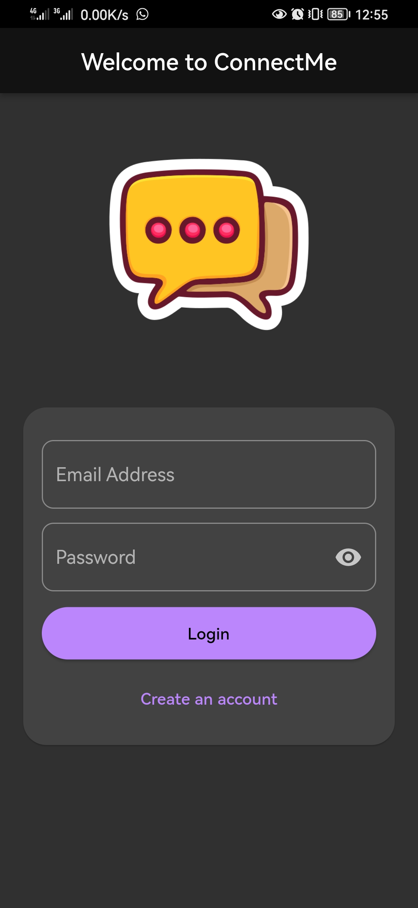
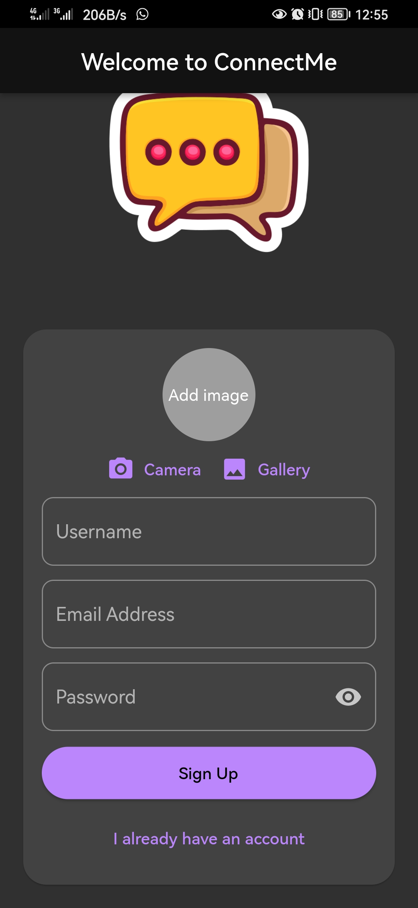
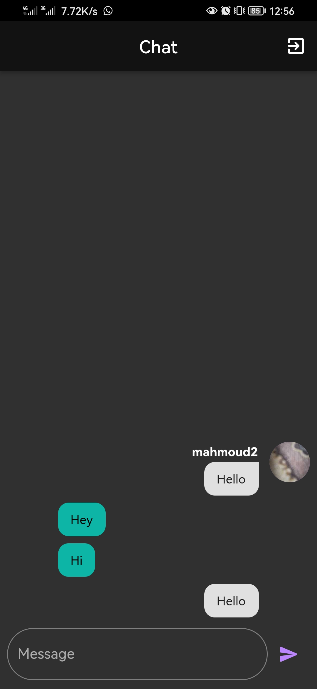

# 💬 ConnectMe

**ConnectMe** is a clean and minimal 1-to-1 chat app built with Flutter and Firebase.  
It supports real-time messaging and lets users personalize their profile with an uploaded picture.

---

## 🚀 Features

- 🔐 Firebase Authentication
- 💬 Real-time 1-to-1 chat via Cloud Firestore
- 🖼️ Profile picture upload using Image Picker and Firebase Storage
- ✨ Simple and responsive UI

---

## 📸 Screenshots

  
  
  

---

## 🛠 Tech Stack

- **Flutter**
- **Firebase Auth**
- **Cloud Firestore**
- **Firebase Storage**
- **Image Picker**

---

## 👨‍💻 Developed by

[**Mahmoud Hassan**](https://github.com/MahmoudHassan12)
